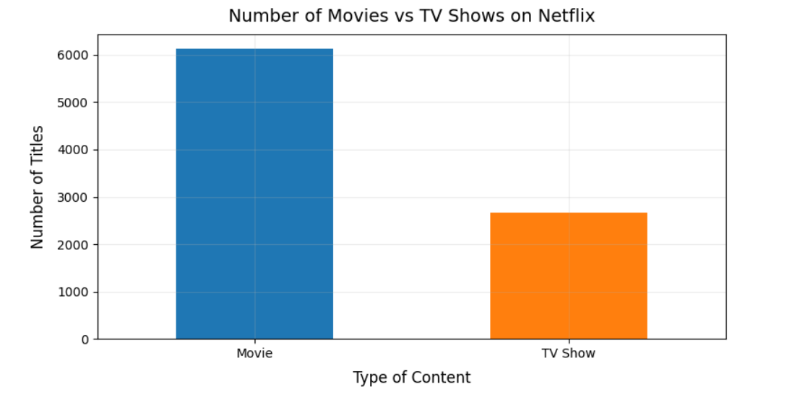
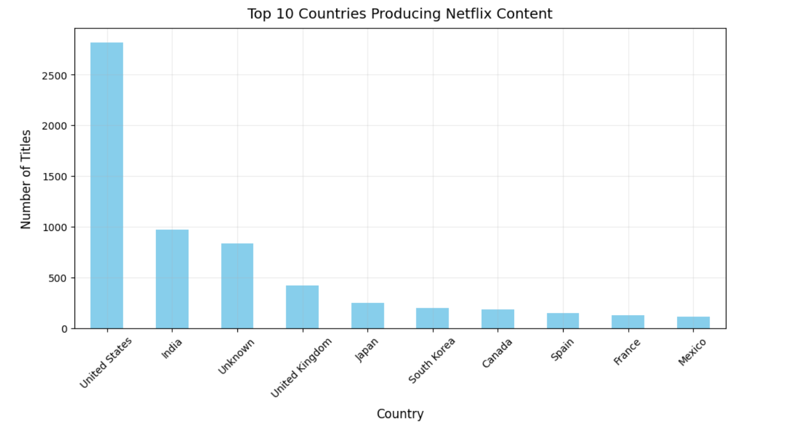
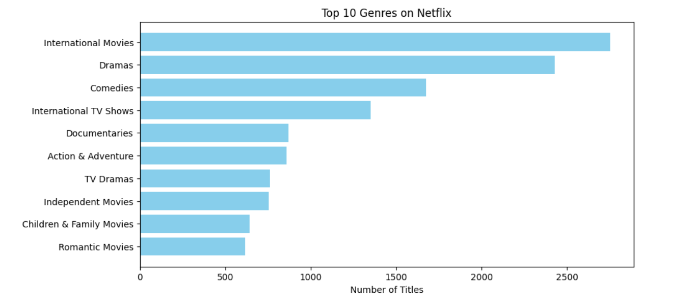
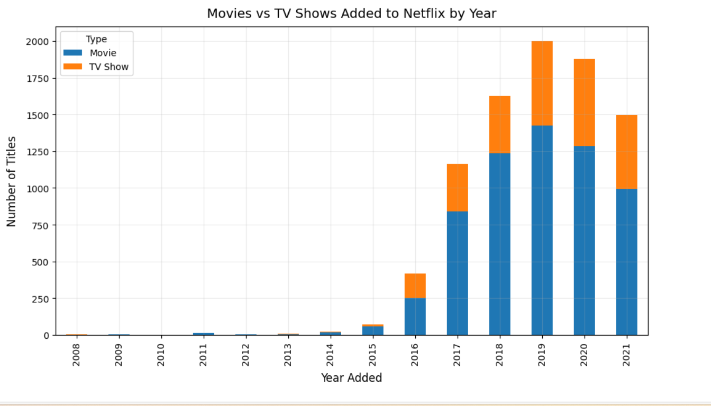

# 🎬 Netflix Content Analysis using Python

## 📌 Project Overview

This project performs an **Exploratory Data Analysis (EDA)** on Netflix’s global catalog of movies and TV shows to uncover patterns in:

* Content types (Movies vs TV Shows)
* Genre popularity
* Ratings distribution
* Duration trends
* Content growth over the years
* Top producing countries

The analysis was done entirely in **Python**, using **Pandas**, **NumPy**, **Matplotlib**, and **Seaborn** for data cleaning, transformation, and visualization.

---

## 📂 Dataset

* **Source:** [Netflix Movies and TV Shows — Kaggle](https://www.kaggle.com/datasets/shivamb/netflix-shows)
* **File in this repo:**

  * `netflix_titles.csv` → Original dataset from Kaggle (cleaning is performed within the notebook).

---

## 🛠 Tools & Libraries Used

* **Python**: Pandas, NumPy, Matplotlib, Seaborn
* **Jupyter Notebook**

---

## 📊 Key Insights

* Movies dominate Netflix’s catalog, but TV shows have grown steadily in recent years.
* Content additions surged after 2016, peaking in 2019.
* **TV-MA** and **TV-14** are the most frequent ratings, highlighting a focus on mature/teen audiences.
* **United States** and **India** are the top producers of Netflix content.
* Most movies are 90–120 minutes long, and most TV shows have only 1 season.

---

## 📷 Sample Visualizations






---

## 🚀 How to Run This Project

1. **Clone this repository:**

   ```bash
   git clone https://github.com/malshetri/netflix-content-analysis.git
   cd netflix-content-analysis
   ```
2. **Install required libraries:**

   ```bash
   pip install pandas numpy matplotlib seaborn
   ```
3. **Open the Jupyter Notebook:**

   ```bash
   jupyter notebook Netflix.ipynb
   ```
4. **Run all cells** to reproduce the analysis and visualizations.

---

## 📌 Author

**\[Muneer Al-Shetri]** — Data Analyst

* GitHub: [malshetri](https://github.com/vijaykumarkatherla)
* LinkedIn: [Your LinkedIn](https://www.linkedin.com/in/katherla-vijay-kumar-566b76265/)

---

